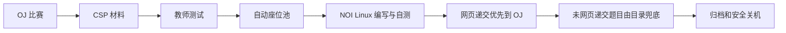

# NOI Linux 考试系统

> 把 OJ 中的一场 OI 比赛转换为标准化、可审计、可自动收卷的远程 NOI Linux 考场。

[](https://github.com/chasemoonn/noi-linux-contest-system-public/actions/workflows/ci.yml)


本系统不重新实现 OJ。OJ 负责账号、比赛、报名、题目、递交、评测、源码和成绩；本系统负责 CSP 风格材料、隔离桌面、正式答案目录、程序回收、座位生命周期、截止冻结、归档和安全关机。

本项目不是 CCF、NOI 或任何 OJ 项目的官方组件，也不能替代正式赛事系统。当前处于 **Alpha**：核心 V1 逻辑与单座闭环已有验证；官方 GNOME 桌面的 15 个正式座位 + 2 个备用座位仍须按当前 commit、镜像和实例规格完成 60 分钟容量签字。

## 产品原则

1. **OJ 是唯一权威**：比赛、报名、时间、提交、评测和成绩只在 OJ 维护。
2. **每题一个正式工作文件**：固定为 `考号/题目名/题目名.cpp`，启动和重连都不覆盖已有代码。
3. **网页递交优先**：每次网页选择 `.cpp` 都立即进入 OJ；同一题一旦有网页递交，最终采用截止前最后一次网页版本。
4. **目录只作兜底**：某题整场没有网页递交时，截止才从正式目录自动递交一次；目录永不覆盖已有网页版本。
5. **一人一容器**：桌面、进程、答案和凭据相互隔离。
6. **OJ 时间唯一**：延后自动同步，提前结束立即冻结；截止后 30 分钟只用于送达和归档。
7. **报名自动扩座**：报名即视为已审核；备用位为 `max(2, ceil(报名人数×10%))`。
8. **失败关闭**：事实、哈希、入口、队列或云状态不能证明正确时，不公开桌面、不关机、不删除。



## 用户体验

### 学生桌面

固定提供以下考试入口：

1. `01_比赛题面.pdf`
2. `02_辅助自测数据/`
3. `03_开始答题`（在 Geany 打开每题唯一的 `题目名.cpp`）
4. `03_答案文件夹/`（目录赛制与截止兜底）
5. `04_程序回收系统`
6. `05_使用说明.txt`

PDF 按 CSP 风格生成。每道题提供 2～4 组不同梯度的 `.in/.out`，仅供本地自测，不进入 OJ 正式测试数据，也不影响得分。

学生点击“开始答题”后在 Geany 编辑、编译和自测。北京赛制通过程序回收系统选择 `.cpp` 递交；目录赛制只需按规定保存。程序回收系统按题显示最后一次网页递交及送达状态，不显示分数、测试点或排行榜；赛后回到 OJ 查看自己的源码和成绩。

### 老师端

老师只接触五个页面：

- 比赛总览
- 比赛材料
- 学生座位
- 递交与评测
- 结束与归档

日常入口位于 OJ 比赛页的“NOI Linux 考试管理”；系统直接使用当前 OJ 教师身份，并且只展示和操作该场比赛。独立管理员密码仅作为技术故障备用，不发给合作教练。

老师可以创建考试、审核材料、运行教师测试、查看自动扩容、替换单个故障座位、打开 OJ 实时成绩、提前结束和重试收卷。老师不能操作服务器、数据库、云密钥、Caddy、PM2、学生口令或强制关机。

## 完整生命周期

1. 老师在 OJ 创建隐藏 OI 比赛、添加题目并开放报名。
2. 系统读取比赛并生成 CSP PDF 与辅助数据。
3. 本地 validator、双跑 oracle、哈希去重通过后，老师预览并批准。
4. 同一 PDF 和数据包以私有附件发布到 OJ，并挂载到学生桌面。
5. 第一座教师测试通过后，系统按报名自动准备所有座位与备用位。
6. 到发放时间后，通过 OJ 站内消息发入口。
7. 学生每次网页递交都可靠写入 outbox，再幂等送到 OJ；每题最后一次网页版本优先。
8. 比赛服务器本地 timer 在截止点先暂停座位、再关闭入口。
9. 系统仅为整场没有网页递交的题目读取目录兜底，等待评测队列并生成收卷凭据。
10. 撤销学生访问规则，30 分钟保护期后再次核验并停止比赛服务器。

## 可靠性设计

- 材料发布、通知和 OJ 送评均有持久幂等键与回执。
- 备赛中进程重启会转为可见错误并保持入口关闭。
- 收卷和安全等待拥有可重复的恢复路径。
- 教师动作和系统状态迁移写入不含密钥、源码和 Token 的审计日志。
- 本地非最终草稿保留 30 天；最终材料和收卷证据保留 180 天；普通 OJ 权威记录从不由本系统清理。专门创建的合成资格测试赛在完整取证和资源关停后，必须及时通过 OJ 原生流程删除并留下脱敏核验回执。
- 清理严格限制在已安全结束的比赛目录，符号链接、越界路径和未登记对象都会使操作停止。
- 普通 OJ 首页、登录和评测是每场比赛前后都必须通过的隔离门。

## 当前支持边界

首个支持目标为 `aliyun-hydro5-pm2-direct-v1`：

- Hydro `>=5.0.1,<5.1.0`，单应用进程；
- PM2/Nix + Caddy 的 OJ 宿主；
- 独立阿里云 Ubuntu 22.04、16 vCPU / 64 GiB 比赛 ECS；
- 固定 EIP、专属安全组和 OJ 管理 `/32`；
- 基于已校验 NOI Linux 2.0 介质的 `noi-linux-official:2.0` GNOME 镜像；
- 一人一 Docker 容器；
- 目标容量 15 个正式座位 + 2 个备用座位。

Direct HTTP 桌面链路仍是短时比赛的 Alpha 方案，存在明文链路和校园网络兼容限制；OJ HTTPS 兼容入口只作回退。详见 [支持矩阵](docs/SUPPORT_MATRIX.md)。

## 仓库结构

| 目录 | 职责 |
| --- | --- |
| `orchestrator/` | 五页教师端、材料、座位、通知、送评、收卷、审计、恢复和云生命周期 |
| `hydro-plugin-orchestrator/` | OJ 私有材料、递交、通知和题目克隆接口 |
| `noi-linux-official/` | 官方 NOI Linux 根文件系统上的桌面与远程访问增量层 |
| `noi-linux-sim/` | 旧 XFCE 应急回退镜像，不作为默认正式环境 |
| `deploy/` | 安装、镜像、比赛运行、验证和回滚 |
| `docs/` | 产品契约、教师指南、支持矩阵和 AI 边界 |
| `release/` | 离线镜像交付与发布清单 |

## 安装与首次验收

当前 Alpha 仍要求技术管理员完成安装，不能把首次部署直接用于正式比赛：

1. 阅读 [V1 产品契约](docs/V1_PRODUCT_CONTRACT.md)和[支持矩阵](docs/SUPPORT_MATRIX.md)。
2. 按[部署说明](deploy/DEPLOYMENT.md)在隔离环境安装控制面和 OJ 插件。
3. 从官方介质构建镜像并运行本机镜像验收。
4. 按[比赛运行手册](deploy/CONTEST_RUNBOOK.md)完成一座真人 canary。
5. 按[验收与容量签字](deploy/VERIFICATION.md)完成故障矩阵与目标容量测试。

## 本地与 CI 检查

Linux、Python 3.12、Node.js 22 和 Bash 是发布基线：

```bash
python -m pip install -r orchestrator/requirements.txt
python -m compileall -q orchestrator
(cd orchestrator && python -m unittest discover -s tests -v)
node --check hydro-plugin-orchestrator/index.js
node --test hydro-plugin-orchestrator/tests/*.test.js
python scripts/run_v1_fault_injection.py --require-linux
bash -n deploy/*.sh scripts/*.sh
python scripts/build_demo.py --check
python scripts/check_public_release.py
```

源码测试不替代真实 Linux/Docker、教师 canary 和 15+2 长稳容量验收。
其中故障注入门专门验证“提交已写入但回执丢失”、插件重启、控制器重启、
核对网络中断和并发认领；任何一个场景失败都禁止构建候选包。
CI 使用 Linux root 运行 `run_v1_linux_ci.py`，在 root-only 临时目录内汇总全部源码门并生成绑定 Git revision 与
`effective_uid=0` 的
`v1-linux-ci-evidence.json`，再由独立核验器验证并作为 artifact 保存。

候选冻结和生产资格是两个独立阶段。使用
[`release/V1_CANDIDATE.md`](release/V1_CANDIDATE.md) 生成并核验逐文件哈希的源码候选；
使用 [`deploy/V1_QUALIFICATION.md`](deploy/V1_QUALIFICATION.md) 完成 Linux、跨机回滚、
单座、故障恢复、普通 OJ 隔离和 15+2 一小时验收。资格报告未全部通过时，工具会强制保持
`production_qualified=false`。

已有 NOI 站点的升级与从未安装 NOI 的干净目标必须走不同事务。首次安装的
显式缺席基线、恢复目标和当前交付边界见
[`docs/V1_CLEAN_INSTALL_TRANSACTION.md`](docs/V1_CLEAN_INSTALL_TRANSACTION.md)；隔离 Linux
资格机上的 13 场景快照顺序见
[`deploy/V1_CLEAN_INSTALL_REHEARSAL.md`](deploy/V1_CLEAN_INSTALL_REHEARSAL.md)。
独立老师必须在第二台干净资格机上用
`scripts/collect_v1_independent_teacher_install_observation.py` 自动生成安装与回滚 observation，不能
手工填写通过项；签名、跨机器和 15+2 长稳门见 [`deploy/V1_QUALIFICATION.md`](deploy/V1_QUALIFICATION.md)。

跨机镜像资格采用六阶段、两主机证据链：导出、导入、提升、回滚、再次提升、恢复原基线。
采集器只读，所有实际切换继续走带 pending marker 的配对事务，禁止手工只改 Docker 标签。

## 安全与隐私

- 不要在 Issue、日志、截图或 AI 对话中公开 `.env`、配置明文、AccessKey、Token、SSH 私钥、座位凭据、真实学生身份、源码或收卷包。
- 活动比赛期间禁止升级。
- AI 可辅助题面整理、脱敏诊断和计划生成，但不能直接修改 OJ 数据、成绩或生产基础设施，也不能生成可信标准答案。
- 漏洞请按 [SECURITY.md](SECURITY.md) 私下报告。

## 主要文档

- [V1 产品契约](docs/V1_PRODUCT_CONTRACT.md)
- [产品说明](docs/PRODUCT.md)
- [教师办赛指南](docs/TEACHER_GUIDE.md)
- [支持矩阵](docs/SUPPORT_MATRIX.md)
- [部署说明](deploy/DEPLOYMENT.md)
- [比赛运行手册](deploy/CONTEST_RUNBOOK.md)
- [验收与容量签字](deploy/VERIFICATION.md)
- [架构与性能](deploy/ARCHITECTURE_AND_PERFORMANCE.md)
- [官方环境一致性](deploy/OFFICIAL_PARITY.md)

本项目按 GNU Affero General Public License v3.0 or later 发布。第三方组件适用各自许可证与来源声明。
