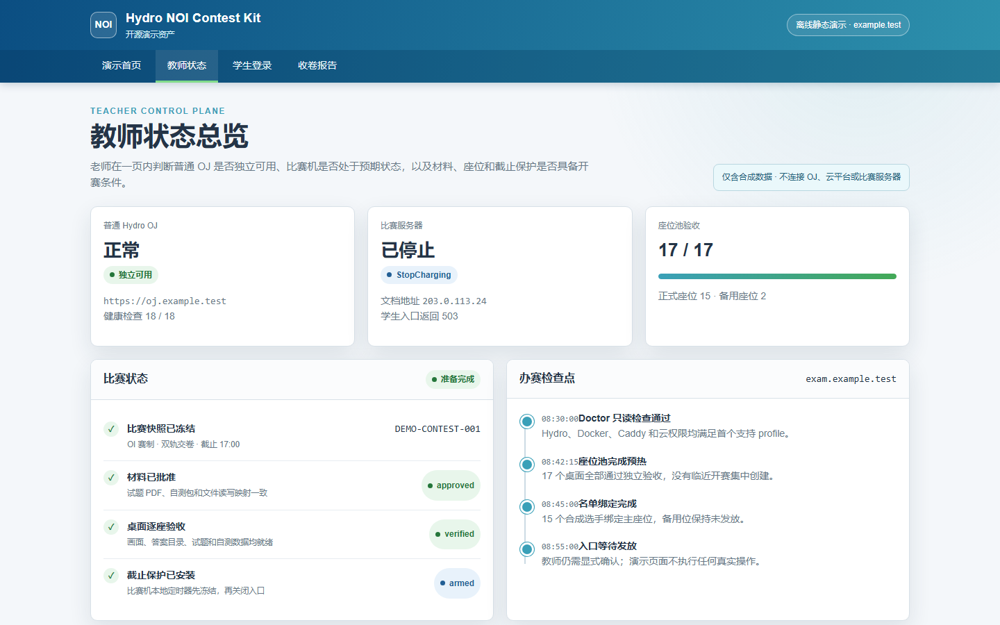
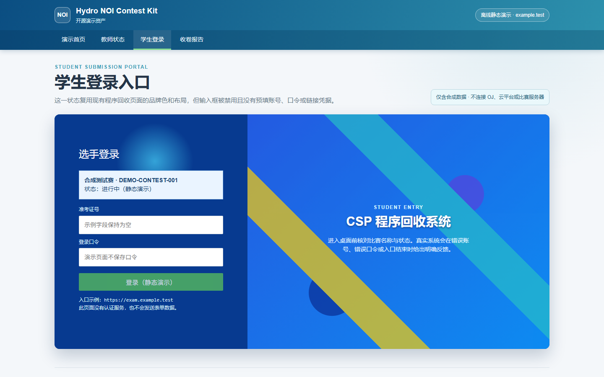
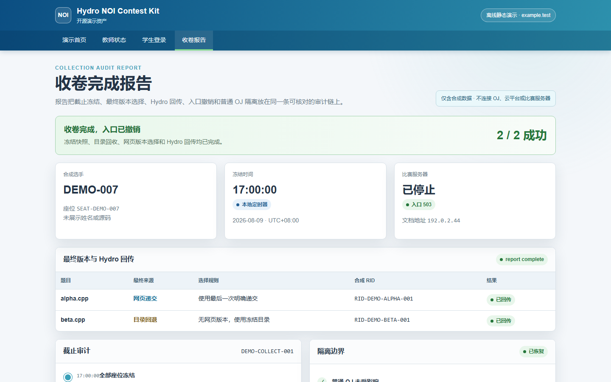
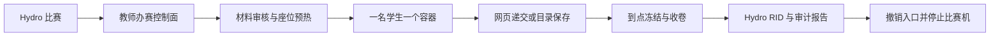

# Hydro NOI Contest Kit

> 把现有 Hydro OJ 扩展成一套可预热、可远程操作、可在截止时自动冻结并回收程序的 NOI Linux 模拟赛平台。

[](https://github.com/chasemoonn/noi-linux-contest-system-public/actions/workflows/ci.yml)


本项目面向需要组织 CSP-J/S、NOIP 或 NOI 风格模拟赛的学校和教师。它在 Hydro 之外增加一套独立控制面，为每名选手提前准备一个隔离的 NOI Linux 桌面，并提供材料审核、名单绑定、网页递交、目录收卷、Hydro 回传、故障座位替换和云主机自动关停。

本项目不是 Hydro、CCF 或 NOI 官方项目，不替代正式赛事系统。当前版本处于 **Alpha**：真人单座闭环已经完成验证；官方 GNOME 桌面的 **15 个正式座位 + 2 个备用位** 容量签字尚未完成，因此当前版本不能据此承诺正式承载 15 人。

| 教师状态台 | 选手登录页 | 收卷报告 |
| --- | --- | --- |
|  |  |  |

以上界面使用固定的脱敏演示数据生成，不包含真实域名、账号、比赛入口或学生答案。生成方法见 [演示资产说明](docs/screenshots/README.md)。

## 它解决什么问题

传统远程模拟赛通常需要老师临时创建虚拟机、逐个发送密码、提醒学生保存文件，并在截止后手工下载和核对程序。本项目把这条流程固化为可审计的生命周期：

1. 从 Hydro 读取比赛、题目和名单。
2. 按容量提前创建并逐座验收桌面。
3. 开赛前发放每名学生独立的入口和凭据。
4. 比赛期间保持 OI 盲测，并支持网页递交或官方目录结构。
5. 截止时由比赛机本地计时器先冻结全部座位。
6. 回收程序、生成 Hydro RID、输出报告并关闭公网入口。
7. 撤销学生访问规则并停止比赛服务器，普通 OJ 不受影响。



## 当前成熟度

| 能力 | 当前状态 | 说明 |
| --- | --- | --- |
| 单座真人闭环 | 已验证 | 登录、桌面编辑、合法文件保存、冻结、收卷、Hydro RID、关机均已完成 |
| 网页递交 | 已验证 | 每次明确递交创建独立 RID；同一次网络重试复用原 RID |
| 目录收卷 | 已验证 | 支持 `准考证号/题目名/题目名.cpp`，截止后冻结再回收 |
| 双轨模式 | 已验证 | 网页为正式版本，目录可作回退；最终规则固定且可审计 |
| 低延迟桌面直连 | Alpha 已验证 | 固定 EIP 裸 HTTP 直连，画质 9、压缩 2；公网明文和校园网络策略是已知限制 |
| 15+2 官方桌面容量 | 待签字 | 需要用当前 GNOME 镜像完成 60 分钟真实操作、编译、重连和统一收卷 |
| 阿里云自动生命周期 | Alpha 已验证 | 固定 EIP、专属安全组、开关机、规则撤销和失败关闭 |
| 腾讯云与自有机房 | 实验性 | 尚未通过与阿里云同等级的入口生命周期和故障恢复认证 |
| 通用自助安装器 | 规划中 | 当前部署仍要求熟悉 Linux、Hydro、Docker、Caddy 和云控制台 |

完整边界见 [支持矩阵](docs/SUPPORT_MATRIX.md)，产品化进度见 [开源路线图](docs/OPEN_SOURCE_ROADMAP.md)。

## 不会为了简单而牺牲的约束

1. **一人一容器**：学生进程、答案目录和桌面会话相互隔离。
2. **官方环境来源可证明**：正式桌面基于经过 SHA256 校验的 NOI Linux 2.0 ISO 构建。
3. **OI 盲测**：学生比赛中看不到分数、测试点或排行榜。
4. **截止先冻结**：比赛机本地 systemd timer 先暂停座位，再关闭入口和收卷。
5. **提交有收据**：源码、选择规则、RID、报告和最终状态可交叉核对。
6. **普通 OJ 隔离**：模拟赛控制面或比赛机故障不得扩大为普通 Hydro 故障。
7. **失败关闭**：网络、安全组、通知、镜像或收卷状态不能证明正确时，不公开学生入口。

## 适合谁

- 已经运行 Hydro `>=5.0.1,<5.1.0`，准备开展 NOI Linux 模拟赛的学校或教师。
- 愿意先在测试比赛中完成一座真人验收的技术管理员。
- 需要网页递交、目录自动回收或二者并行的 OI 比赛。
- 希望比赛服务器平时关机节省费用、赛前自动预热的团队。

当前版本不适合：没有 Linux 管理人员、直接在正式比赛中首次安装、多人共享同一个 Hydro 应用进程、或要求完全无需云端/服务器配置的场景。

## 首个官方支持目标

首个正式支持配置命名为 `aliyun-hydro5-pm2-direct-v1`：

- Hydro `>=5.0.1,<5.1.0`，单应用进程；
- PM2/Nix + Caddy 的 Hydro 宿主；
- 独立的阿里云 Ubuntu 22.04 比赛 ECS；
- 16 vCPU / 64 GiB 内存；
- 固定 EIP 和主网卡专属 basic 安全组；
- `noi-linux-official:2.0` GNOME 桌面；
- 一名学生一个 Docker 容器；
- 目标容量 15 个正式座位和 2 个备用座位。

这里的“目标容量”只有在 [容量验收](deploy/VERIFICATION.md) 完成并进入发布清单后，才会升级为“已认证容量”。

## 组件

| 目录 | 职责 |
| --- | --- |
| `orchestrator/` | 教师控制面、配置校验、座位池、通知、实时送评、收卷和云生命周期 |
| `hydro-plugin-orchestrator/` | Hydro `>=5.0.1,<5.1.0` 的递交、通知和私有题目接口 |
| `noi-linux-official/` | 官方 NOI Linux 根文件系统上的桌面与远程访问增量层 |
| `noi-linux-sim/` | 旧 XFCE 应急回退镜像，不作为默认正式环境 |
| `deploy/` | 服务器初始化、镜像构建、验证、发布和回滚脚本 |
| `docs/` | 产品说明、支持矩阵、教师指南、架构与 AI 协作边界 |
| `release/` | 发布清单、离线镜像交付说明、导入导出与校验工具 |

## 快速开始

当前 Alpha 仍要求技术管理员完成部署，不能直接把下面步骤用于正式比赛。

1. 阅读 [支持矩阵](docs/SUPPORT_MATRIX.md)，确认宿主、Hydro 和比赛服务器符合首个 profile。
2. 阅读 [部署说明](deploy/DEPLOYMENT.md)，在隔离环境安装控制面与 Hydro 插件。
3. 使用官方 ISO 构建桌面镜像，并运行 [本机镜像验收](deploy/verify-contest-image-local.sh)。
4. 按 [教师办赛手册](deploy/CONTEST_RUNBOOK.md) 创建隐藏测试赛。
5. 先完成一名真人的登录、编辑、保存、递交、冻结、收卷和关机闭环。

老师日常操作从 [教师办赛指南](docs/TEACHER_GUIDE.md) 开始；技术管理员再阅读部署和服务器 Runbook。

未来的安装入口会收敛为：

```text
noictl doctor
noictl init
noictl install --plan
noictl install --apply
noictl verify
noictl canary
noictl rollback
```

`doctor` 必须严格只读；任何写操作必须先生成计划，再由管理员显式确认执行。

## 教师办赛流程

教师日常目标是不再接触 SSH、Docker、Caddy、安全组或 AccessKey，而是在浏览器中完成：

1. 选择 Hydro 比赛并核验 OI 赛制、时间和题目。
2. 选择 `folder`、`web` 或 `both`，上传试题和自测材料。
3. 选择经过认证的容量档，审核不可变办赛计划并预热。
4. 绑定名单、发放入口、监控座位并在需要时切换备用位。
5. 冻结、收卷、回传 Hydro、关机并下载赛后归档包。

现有后台已经覆盖这些能力，但仍是一张工程操作台；分步安装和办赛向导属于开源产品化路线的一部分。

## AI 可以做什么

AI 是可选助手，不是安全边界，也不是安装前提。

允许 AI：

- 解释 `noictl doctor --json` 的脱敏诊断；
- 根据版本化配置生成变更计划；
- 辅助撰写题面和自测输入草稿；
- 根据脱敏支持包给出排障建议；
- 在本地或隔离环境复现测试。

禁止 AI：

- 直接修改 MongoDB、SQLite、Hydro 比赛数据或学生成绩；
- 绕过 SSH 主机指纹、安全组、容量和活动比赛门禁；
- 输出或上传密码、AccessKey、Token、隐藏数据和学生源码；
- 在没有明确计划与确认时重启 Hydro、修改 Caddy 或启动收费资源；
- 把 AI 生成的答案当成可信标准答案。

AI 材料模式中，输入必须经过本地 validator，输出必须由本地可信 oracle 独立运行两次并一致，最后仍由教师批准。

## 离线桌面镜像

GitHub 仓库不保存完整桌面镜像、ISO、OCI tar 或其他大体积二进制。

完整镜像通过独立的本地交付目录或其他渠道分发。每个离线包必须包含：

- 镜像归档；
- 桌面镜像 `manifest.json` 与对应 JSON Schema；
- `SHA256SUMS`；
- 包内自带的导入与导入后验证脚本；
- 对应源码 revision 和镜像 immutable ID；
- ISO SHA256 与桌面 contract；
- 与 GitHub Release 中 `release-manifest.json` 的匹配关系。

组合版 `release-manifest.json` 不重复塞入桌面包，而是随 GitHub Release 发布，并记录离线包 manifest 的 SHA256。详见 [本地离线镜像交付](release/LOCAL_IMAGE_BUNDLE.md)。仓库中的 `.gitignore` 会阻止常见镜像归档和 `local-release/` 目录被误提交。

## 本地检查

完整测试套件以 Linux/WSL、Python 3.12、Node.js 22 和 Bash 为基线；Windows 可直接运行第一批 `noictl` 和纯 Python 静态检查，但原生依赖与 POSIX 安全测试仍应以 Linux CI 结果为准。建议先创建虚拟环境，再安装固定依赖：

```bash
python -m pip install -r orchestrator/requirements.txt
python -m compileall -q orchestrator
(cd orchestrator && python -m unittest discover -s tests -v)
node --check hydro-plugin-orchestrator/index.js
node --test hydro-plugin-orchestrator/tests/*.test.js
bash -n deploy/*.sh scripts/*.sh
python scripts/build_demo.py --check
python scripts/check_public_release.py
```

`check_public_release.py` 同时支持 Git 工作树和 GitHub 下载的、不含 `.git` 的源码 ZIP；后者会扫描导出目录中的全部对象，不会依赖本地忽略规则跳过文件。

桌面镜像还必须在 Linux/Docker 主机上完成 folder、web、both 三模式验收。源码测试通过不等于桌面镜像或 15+2 容量已经通过。

## 安全与故障报告

- 不要在公开 Issue 中粘贴 `.env`、配置文件、AccessKey、Token、比赛入口、学生账号、源码或收卷包。
- 先生成脱敏诊断，再提交版本号、稳定错误码和最小复现步骤。
- 活动比赛期间禁止升级控制面、Hydro 插件或桌面镜像。
- 发现漏洞请按 [安全策略](SECURITY.md) 私下报告。

## 文档

- [产品定义](docs/PRODUCT.md)
- [支持矩阵](docs/SUPPORT_MATRIX.md)
- [开源路线图](docs/OPEN_SOURCE_ROADMAP.md)
- [教师办赛指南](docs/TEACHER_GUIDE.md)
- [`noictl` 命令契约](docs/NOICTL_COMMAND_CONTRACT.md)
- [AI 协作边界与受限指令](docs/ai/README.md)
- [部署说明](deploy/DEPLOYMENT.md)
- [教师办赛手册](deploy/CONTEST_RUNBOOK.md)
- [架构与性能](deploy/ARCHITECTURE_AND_PERFORMANCE.md)
- [官方环境一致性](deploy/OFFICIAL_PARITY.md)
- [验证记录与适用边界](deploy/VERIFICATION.md)
- [离线镜像交付](release/LOCAL_IMAGE_BUNDLE.md)
- [首次公开发布检查单](docs/PUBLICATION_CHECKLIST.md)

## 许可证与来源

本项目按 GNU Affero General Public License v3.0 or later 发布，具体条款见 `LICENSE`。Hydro、NOI Linux、Ubuntu、GNOME、noVNC、TigerVNC 及其他第三方组件仍适用各自许可证和来源声明。

使用本项目不代表获得 Hydro、CCF、NOI 或任何赛事组织方的官方认可。请保留 Hydro 的来源署名，并在公开部署修改版本时遵守相应开源义务。

## 贡献

当前最需要的贡献不是增加更多云厂商，而是：

- 在全新受支持环境中验证安装流程；
- 完成当前 GNOME 镜像的 15+2 长稳容量验收；
- 改进只读诊断、失败清理和完整回滚；
- 提供脱敏截图、教师指南和不同校园网络的体验数据；
- 补齐阿里云之外的能力认证，而不是只实现“能开关机”。

提交代码前请阅读 [贡献指南](CONTRIBUTING.md) 与 [社区行为规范](CODE_OF_CONDUCT.md)。所有正式能力都必须有机器测试、真人 canary 和明确的失败关闭行为。
