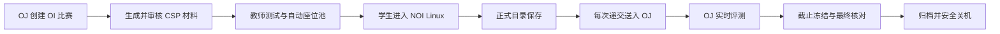

# NOI Linux 考试系统：产品说明

NOI Linux 考试系统把 OJ 中的一场 OI 比赛转换为一场标准化的远程复赛环境。它不重新实现题库、判题或成绩系统；核心仍是 OJ，只把学生写代码、自测和正式程序回收的过程搬到隔离的 NOI Linux 桌面。

## 用户能得到什么

### 学生

- 一人一座、相互隔离的 NOI Linux 图形桌面；
- CSP 风格 PDF 和每题 2～4 组不计分的 `.in/.out` 辅助数据；
- 固定的 `考号/题目名/题目名.cpp` 正式答案目录；
- 与既有程序回收体验一致的网页入口，但递交时只读取正式目录，不形成第二份源码；
- 每次递交都生成 OJ 记录，比赛后在 OJ 查看自己的源码和成绩；
- 桌面故障时自动切换到带有一致答案快照的备用座位。

### 老师

- 五页、面向办赛流程的控制面，不接触服务器或云平台；
- CSP 材料预览、机器校验与一次批准；
- 报名驱动的自动座位扩容和教师测试；
- OJ 中的实时源码、提交和成绩；
- 单座替换、截止收卷、送达核验、归档和安全关机；
- 不含口令和源码的操作审计与状态证据。

### 学校与管理员

- 普通 OJ 与临时比赛桌面隔离；
- 失败关闭的公网入口和访问规则；
- 不可变镜像、材料哈希、收卷凭据和幂等送评；
- 比赛机按需启停，安全结束后自动停止计费；
- 明确的 30/180 天本地保留策略；普通 OJ 权威数据不由本系统清理，专用合成资格测试赛在完成证据链和资源关停后及时通过 OJ 原生流程删除并独立核验。

## 唯一主流程

V1 不再让老师选择 `web`、`folder` 或 `both`。正式答案目录是唯一源码，网页只是“读取并递交当前正式文件”的操作界面。这样学生看到的文件、截止时收取的文件和 OJ 评测的文件可以用同一 SHA256 交叉证明。

每题只读取规定路径中的 `题目名.cpp`。学生在同一题目目录编译、自测时产生的二进制、输入、输出或 IDE 临时目录不参与评分，也不会覆盖或改变正式源码；文件名、目录名、`freopen` 和源码本身仍按 CSP 规则严格检查。

## 比赛材料

- PDF 按 CSP 风格排版，展示题目顺序、程序名、输入输出文件名和注意事项。
- 每题生成 2～4 组不同梯度的公开辅助输入，由受信任的本地标准程序生成 `.out`。
- 辅助数据与 OJ 正式测试数据物理、逻辑分离，不进入计分配置。
- AI 只可参与题面整理和辅助输入草稿；validator、双跑 oracle、哈希去重和教师批准构成发布门。
- OJ 私有附件与学生桌面必须是同一 PDF、同一辅助数据包、同一哈希。

## 递交与成绩

- 每次递交先持久化，再以幂等编号调用 OJ；网络重试不能产生重复记录。
- 同一题可以多次递交，OJ 保留每次记录；最终以截止前最后一次已确认的正式文件为准。
- 截止冻结后，系统比较正式目录与最后已确认递交；文件不同或尚未递交时补交最终版本。
- 老师在 OJ 查看源码、实时成绩和最终排名；NOI Linux 不复制成绩表。
- 学生在 OI 比赛中保持盲测，赛后回到 OJ 查看源码和成绩。

## 时间与容量

- OJ 开始和截止时间是唯一权威时间。
- 延后比赛时，NOI Linux 截止同步延后；提前结束时立即冻结。
- 截止后 30 分钟仅供送评、核验和归档，不是学生加时。
- OJ 报名即视为老师已审核；新增报名自动增加、验收并发放座位。
- 备用座位数为 `max(2, ceil(报名人数 × 10%))`，受部署容量上限约束。

## 安全边界

1. 一人一容器，答案目录和凭据相互隔离。
2. OJ 普通服务不以重启 Hydro/Caddy/数据库作为比赛恢复步骤。
3. 非唯一 `ready` 比赛、截止、错误或事实漂移都会关闭桌面入口。
4. 比赛服务器本地计时器是精确截止防线，控制面失联也要冻结。
5. 送评、通知和材料发布都有持久幂等记录。
6. 关机前必须证明最终代码送达、队列清空、入口关闭和访问规则收敛。
7. 教师界面不显示云密钥、口令、Token、数据库和基础设施控制。

## 明确不做什么

- 不替代 OJ 的账号、比赛、题库、判题、源码和成绩；
- 不修改共享题的正式测试数据来生成辅助数据；
- 不允许老师在比赛中选择多套源码优先级；
- 不把“已产生 RID”误认为“评测已完成”；
- 不在活动比赛期间升级控制面、插件或桌面镜像；
- 不在证据不足时强制关机或删除本地文件；
- 不宣称获得 CCF、NOI 或任何 OJ 项目的官方认证。

精确状态机、失败条件和验收口径见 [V1 产品契约](V1_PRODUCT_CONTRACT.md)，教师操作见 [教师办赛指南](TEACHER_GUIDE.md)，部署边界见 [支持矩阵](SUPPORT_MATRIX.md)。
